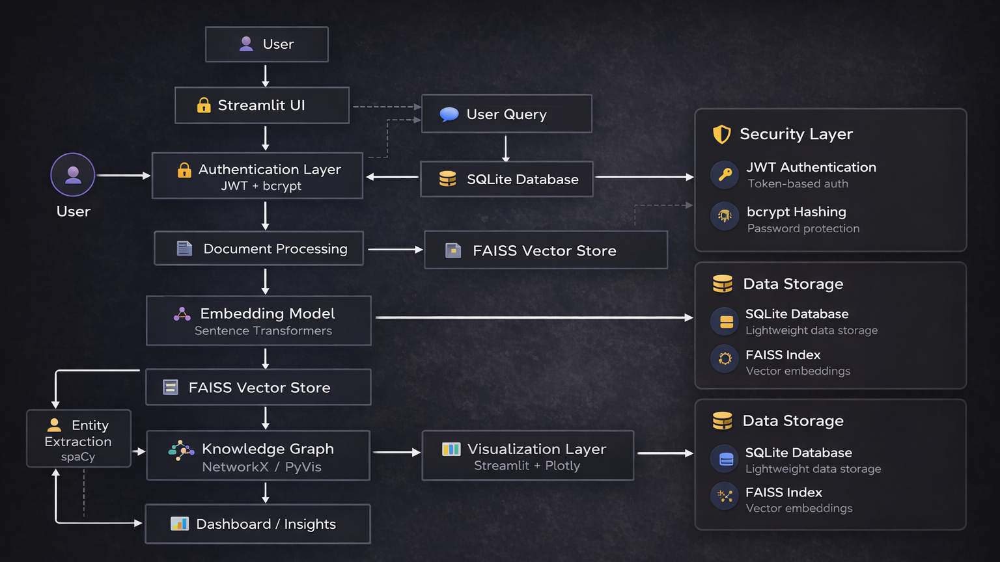
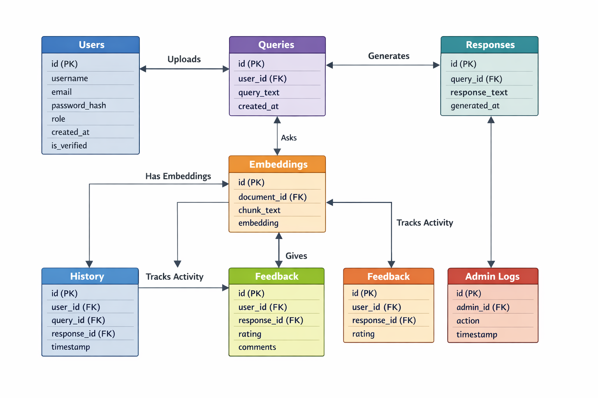
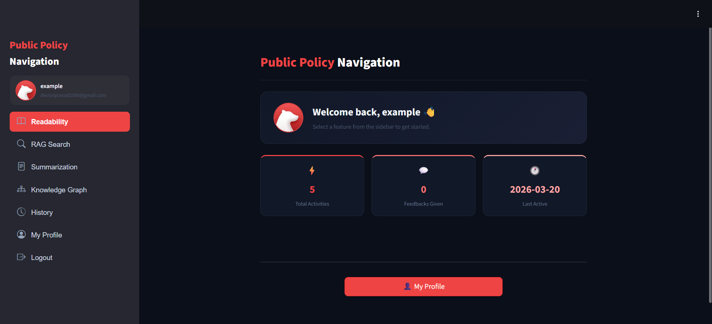
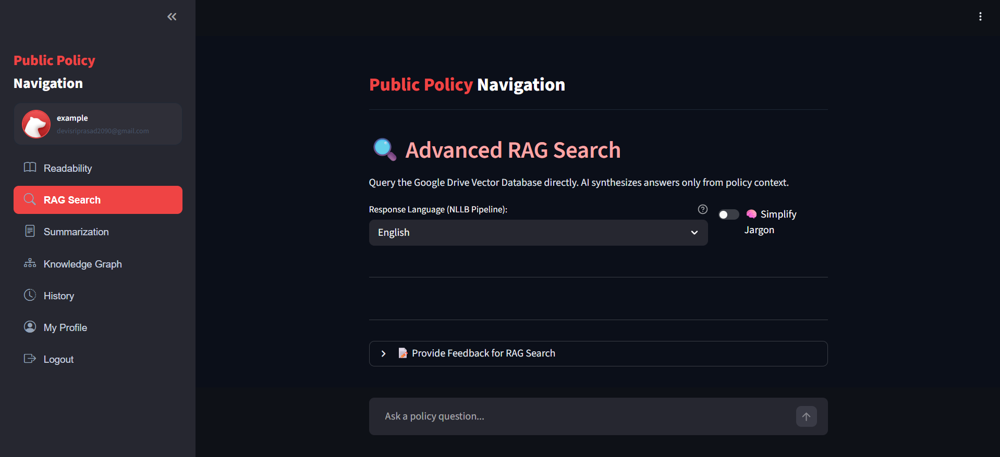
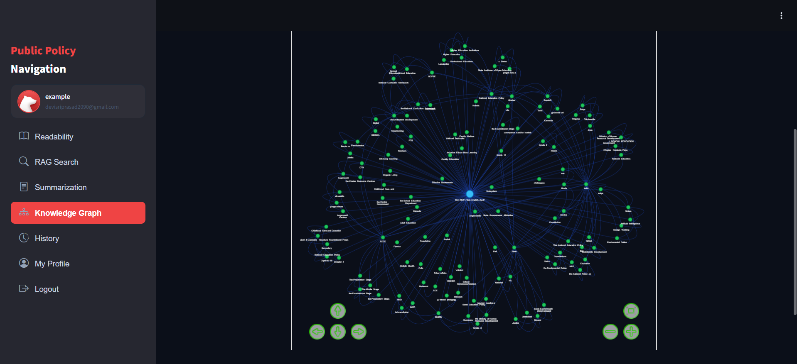
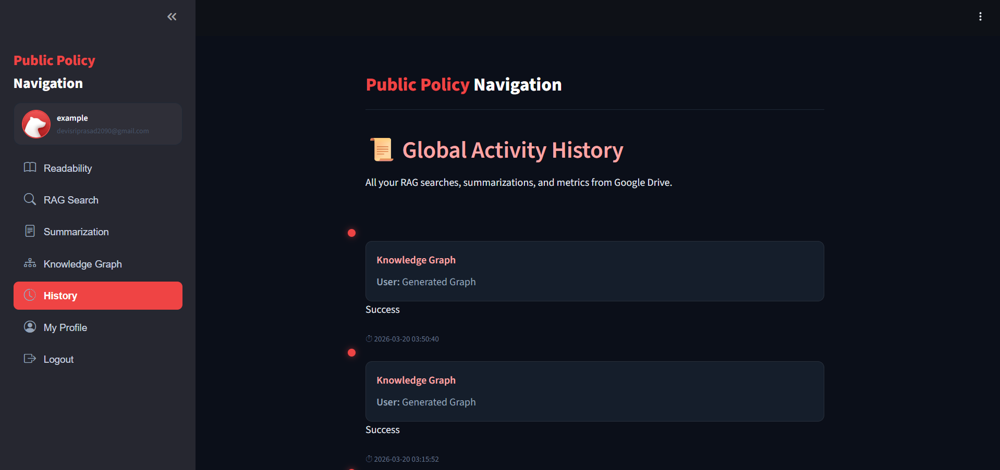
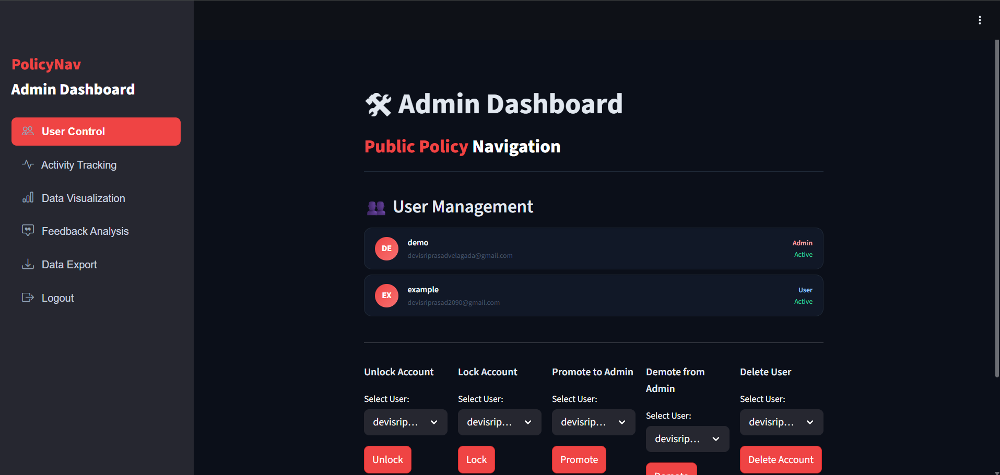
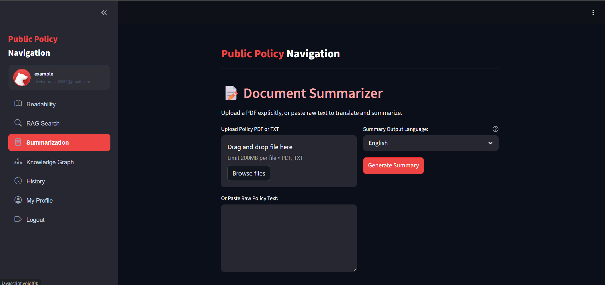

# Infosys_Springboard_PolicyNav_Public-_Policy_Navigation_Using_AI- Velagada Devi Sri Prasad
# 🧠 PolicyNav
AI-Powered Policy Document Analysis & Navigation System  
Transforming complex policy documents into actionable insights using AI.


## 📌 Table of Contents

- About the Project  
- Problem Statement & Motivation  
- Key Features  
- Architecture  
- Tech Stack  
- Models Used  
- Project Structure  
- Installation & Setup  
- Usage Guide  
- Admin Controls  
- Datasets & Evaluation  
- Screenshots  
- Roadmap  
- Team  
- License  


## 📖 About the Project

**PolicyNav** is an AI-powered system designed to simplify the exploration and understanding of complex policy documents using modern NLP techniques and Retrieval-Augmented Generation (RAG).

It enables users to:
- Search across large document collections intelligently  
- Generate contextual answers using AI  
- Visualize relationships via knowledge graphs  
- Summarize lengthy documents  
- Analyze readability of content  

📌 Built as part of **Infosys Springboard Internship Final Project**  
📌 Target users: Researchers, policy analysts, students, government professionals  


## 🎯 Problem Statement & Motivation

Policy documents are:
- Lengthy and difficult to navigate  
- Written in complex language  
- Time-consuming to analyze manually  

🔹 Our solution uses AI to:
- Extract meaningful insights instantly  
- Enable semantic search across documents  
- Visualize relationships between entities  
- Simplify and summarize complex content  


## 🚀 Key Features

### 👤 User Features

| Feature | Description |
|--||
| 🔐 Secure Authentication | JWT-based login & registration |
| 🔎 RAG Search | AI-powered semantic search using FAISS |
| 📊 Readability Analyzer | Flesch, Gunning Fog, SMOG metrics |
| 🧠 Document Summarization | Transformer-based summarization |
| 🌐 Knowledge Graph | Entity relationship visualization |
| 🕘 Query History | Track previous searches & outputs |
| 📈 Dashboard | Interactive analytics & insights |


### 🛠 Admin-only Features

- Secure admin access  
- Upload and manage policy documents  
- Monitor system usage  
- View user activity and search logs  
- Manage document indexing and vector store  


## 🧩 Architecture

Monolithic AI system integrating NLP pipelines, vector search, and visualization tools.
## 🧩 Architecture Diagram

<p align="center">
  
  <br/>
  <em>Figure: End-to-end system architecture of PolicyNav</em>
</p>


## 🗄 Database Schema

<p align="center">
  
  <br/>
  <em>Figure: Entity Relationship Diagram (ERD) of the system database</em>
</p>


## 🛠 Tech Stack

| Layer | Technology |
||--|
| Frontend | Streamlit |
| Backend | Python |
| NLP Models | Hugging Face Transformers |
| Vector Search | FAISS |
| Database | SQLite |
| Security | JWT, bcrypt |
| Visualization | Plotly, PyVis |
| NLP | spaCy |


## 🤖 Models Used

| Model / Tool | Purpose | Framework |
|-------------|--------|----------|
| Sentence Transformers | Text embeddings for semantic search | 🤗 Transformers |
| FAISS | Vector similarity search (RAG retrieval) | Facebook AI |
| Qwen2.5 | Answer generation (LLM) | Transformers |
| spaCy | Named Entity Recognition | spaCy |
| TextStat | Readability scoring | Python |

| Model / Tool | One-line Description |
|-------------|--------------------|
| Sentence Transformers | Converts text into dense vector embeddings for semantic understanding |
| FAISS | Performs fast similarity search on vector embeddings for retrieval |
| Qwen2.5 | Generates context-aware answers using large language modeling |
| spaCy | Extracts named entities and linguistic features from text |
| TextStat | Calculates readability scores to evaluate text complexity |
## ⚙️ Installation & Setup

### Prerequisites
- Python 3.10+
- Git  
- (Optional) GPU support  


### 🧑‍💻 Local Setup

```bash
git clone <repository-link>
cd PolicyNav
pip install -r requirements.txt
```
## 🔐 Configuration & Environment Setup

To securely run the application (especially in Google Colab), you need to configure environment variables using **Ngrok** and **Gmail App Passwords**.


### 🌐 Ngrok Setup (for Public URL)

Ngrok is used to expose your Streamlit app running in Colab to the internet.

#### Steps to Get Ngrok Auth Token:

1. Visit: https://ngrok.com/  
2. Create a free account and log in  
3. Go to the **Dashboard**  
4. Copy your **Authtoken**


### 🔑 Add Ngrok Secret in Google Colab

1. Open your notebook in **Google Colab**  
2. Click the **🔐 Secrets (key icon)** in the left sidebar  
3. Click **“Add new secret”**  
4. Enter:

| Key | Value |
|--||
| `NGROK_AUTH_TOKEN` | Your copied ngrok token |

5. Save and enable access


### 📧 Gmail App Password Setup

Used for sending emails (OTP, verification, alerts).

#### Steps to Generate App Password:

1. Go to **Google Account → Security**  
2. Enable **2-Step Verification** (required)  
3. Search for **App Passwords**  
4. Select app type (e.g., *Mail*)  
5. Generate password  
6. Copy the **16-digit password immediately**

⚠️ Important:
- Do NOT use your normal Gmail password  
- You cannot view this password again after closing  


### 🔑 Add Gmail Secrets in Colab

Add the following secrets:

| Key | Value |
|--||
| `EMAIL_ID` | Your Gmail address |
| `EMAIL_APP_PASSWORD` | 16-digit app password |


### 📦 Final Environment Variables

Your configuration should include:

```env
NGROK_AUTH_TOKEN=your_ngrok_token
JWT_SECRET_KEY=your_secret_key
EMAIL_ID=your_email@gmail.com
EMAIL_APP_PASSWORD=your_app_password
```

## 📝 Usage Guide

1️⃣ **Register/Login**  
2️⃣ **Upload or select policy documents**  
3️⃣ **Perform semantic search queries**  
4️⃣ **View AI-generated answers**  
5️⃣ **Explore knowledge graph**  
6️⃣ **Generate summaries**  
7️⃣ **Analyze readability**  
8️⃣ **View history and dashboard insights**  

📌 *Screenshots included below 👇*


## 📊 Datasets & Evaluation

### 📁 Datasets Used

| Dataset | Usage |
|--------|------|
| Policy Documents (Custom) | RAG search corpus |
| Government Reports | Real-world testing |
| Web Scraped Docs | Knowledge graph generation |


### 📈 Evaluation Metrics

- Semantic relevance (**RAG accuracy**)  
- Response quality (**LLM output**)  
- Readability score improvements  
- Knowledge graph completeness  


## 📸 Screenshots

### 📊 Dashboard



### 🔎 RAG Search



### 🌐 Knowledge Graph



### 🕘 History



### 🛠 Admin Panel



### 🧠 Summarization



## 🛣 Roadmap

- 🌍 Multi-language support  
- 🔀 Hybrid search (BM25 + Vector)  
- 👥 Role-based access control  
- 🐳 Docker deployment  
- 🤝 Real-time collaboration features  


## Mentor
Mohammad Sipli M
## 👥 Team

| Name | Role | Responsibilities |
|-----|-----|----------------|
| Add Name | ML Engineer | RAG pipeline, embeddings, evaluation |
| Add Name | Backend Developer | Authentication, database |
| Add Name | Frontend Developer | Streamlit UI |
| Add Name | Documentation | README, report |


## 📜 License

🆓 **MIT License**  
Free to use, modify, and distribute with attribution.
